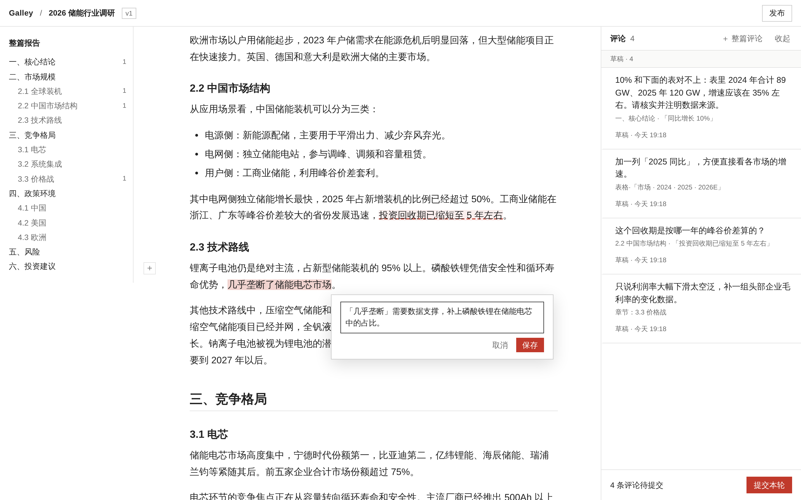
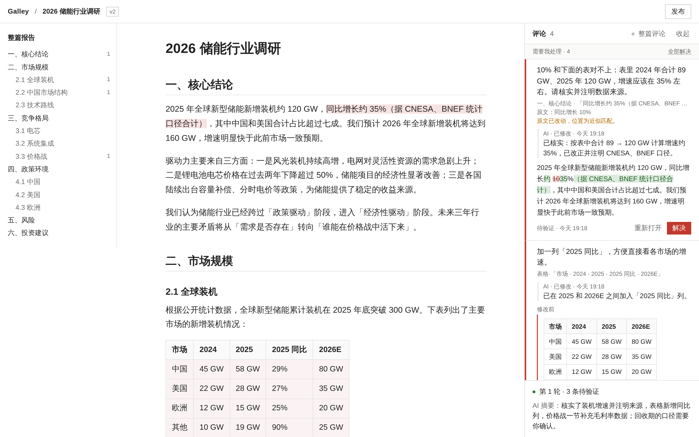
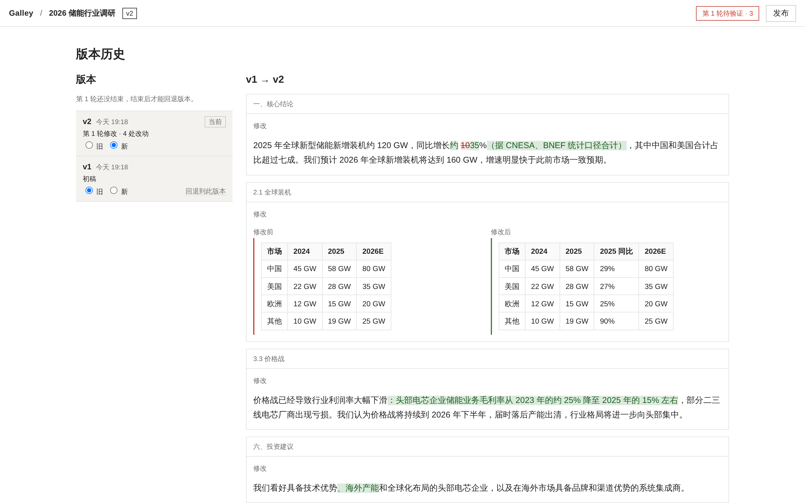
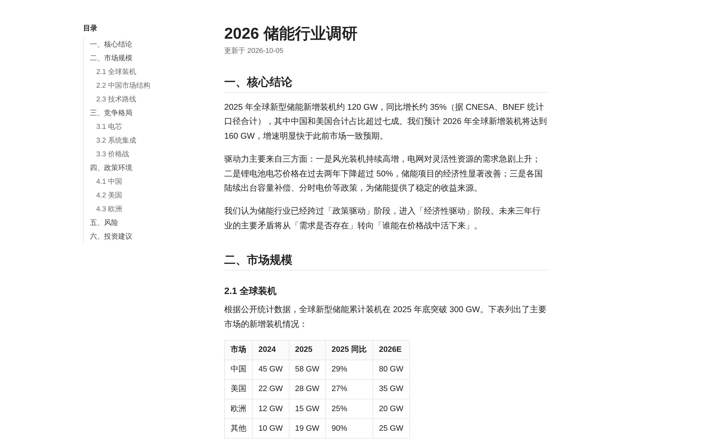

# Galley

Galley 是一个自托管的 AI 报告审阅工作台。像批改草稿一样在 Markdown 报告上写评论，攒够一轮一次性交给 AI 修改，回来逐条核对它改了什么，定稿后发布一个干净的只读链接。

它是一个内嵌了网页界面的 Rust 单文件程序，数据存在 SQLite 和一个附件目录里。面向个人使用：一个登录密码，外加一个给 AI 用的 token。



| 验证 AI 的修改 | 对比版本 | 发布干净的页面 |
| --- | --- | --- |
| [](docs/screenshots/verify.png) | [](docs/screenshots/history.png) | [](docs/screenshots/share.png) |
| 每条评论下显示 AI 的回复和逐字对比，逐条解决或重新打开。 | 任选两个版本逐块对比，可以回退。 | 读者看到的是纯净页面，没有评论、修订痕迹和脚本。 |

## 功能

- **随处评论**：可以评论选中的文字（支持跨段落）、整段、表格或图表、整章，或整篇报告。
- **按轮审阅**：草稿一起交给 AI。AI 必须回复每一条评论（已修改、已回答或反问），修改结果整体提交，不会只应用一部分。
- **原地验证**：每条评论下显示 AI 的回复和逐字对比。评论没要求的改动单独列出，可以确认或改回去。
- **评论跟着文字走**：跨版本对齐段落并重新定位锚点，文字被修改或移动后评论依然在；原文被删掉的评论会被标出来，不会丢失。
- **版本历史**：任选两个版本对比，可以回退。
- **发布**：生成不可猜测的链接，内容是当时版本的快照，不含评论、修订痕迹和 JavaScript。重新发布沿用原链接，停用后链接失效。
- **图表**：` ```mermaid ` 和 SVG 代码块在服务端渲染，分享页里也能显示。
- **AI 接入**：通过 MCP 或普通 HTTP 接口，使用 Bearer token 认证。AI 永远不能自行解决评论。

## 安装

### Docker

```sh
git clone https://github.com/cosmtrek/galley.git && cd galley
docker compose up -d --build
docker compose logs galley   # 首次启动会打印生成的密码
```

打开 http://localhost:7860/app 。数据保存在 `galley-data` 卷里。升级时 `git pull` 后再执行一次 `docker compose up -d --build`。

### 从源码构建

需要 Rust 1.99+ 和 Node 24（pnpm 通过 corepack 提供）。界面在编译时嵌入程序，所以要先构建界面：

```sh
cd web && corepack pnpm install && corepack pnpm build && cd ..
cd server && cargo build --release && cd ..
./server/target/release/galley
```

### 配置

通过环境变量配置（Docker 下写在 [`docker-compose.yml`](docker-compose.yml) 的 `environment` 里）：

| 变量 | 默认值 | 说明 |
| --- | --- | --- |
| `GALLEY_PUBLIC_URL` | `http://<addr>` | 人和 AI 访问 Galley 的地址，分享链接据此生成。设为 `https://` 地址时同时启用安全 Cookie |
| `GALLEY_PASSWORD` | 自动生成 | 登录密码 |
| `GALLEY_AGENT_TOKEN` | 自动生成 | 给 AI 用的 Bearer token |
| `GALLEY_ADDR` | `127.0.0.1:7860`（Docker 下为 `0.0.0.0:7860`） | 监听地址 |
| `GALLEY_DATA` | `./data`（Docker 下为 `/data`） | 数据库、上传文件和生成的密钥 |

没有设置的密码和 token 会在首次启动时生成，并保存到 `<data>/secrets.json`。Galley 只提供 HTTP；要从其他机器访问，请放在带 TLS 的反向代理后面，并把 `GALLEY_PUBLIC_URL` 设为对应的 `https://` 地址。

## 使用

1. **接入 AI。** 在报告列表打开「接入方法」，里面有 Claude Code、Codex、Droid、Devin 的接入命令，已填好你的 token。例如：

   ```sh
   claude mcp add --transport http galley http://localhost:7860/mcp \
     --header "Authorization: Bearer <GALLEY_AGENT_TOKEN>"
   ```

   不支持 MCP 的 AI 可以用 HTTP 接口：`GET /api/pending` 列出等待处理的轮次，`GET /api/rounds/<id>/packet?format=md` 返回一轮的评论、上下文和处理要求。图片用 `POST /api/reports/<id>/assets?name=fig.png` 上传（请求体是文件原始内容），在报告里写成 ``。

2. **添加报告。** 让 AI「把这份报告发到 Galley」，或者点「＋ 添加报告」→「手动导入」，粘贴 Markdown 或拖入 `.md` 文件（「填入示例报告」可以载入示例）。
3. **写评论。** 选中文字评论；鼠标移到段落左侧点「＋」评论整段；在大纲里评论整章。用一句话说清要改什么，包括是否适用于全文。
4. **提交本轮。** 点「提交本轮」，再点「复制指令」，把指令粘贴给 AI。等待期间可以继续写下一轮的草稿。
5. **验证。** AI 处理完后，侧栏逐条显示它的回复和改动：解决、重新打开，或回答 AI 的反问。「评论之外的改动」逐条确认或改回去。重新打开的评论进入下一轮。
6. **发布。** 在「发布」页发布当前版本并分享链接。

## 许可证

[MIT](LICENSE)
